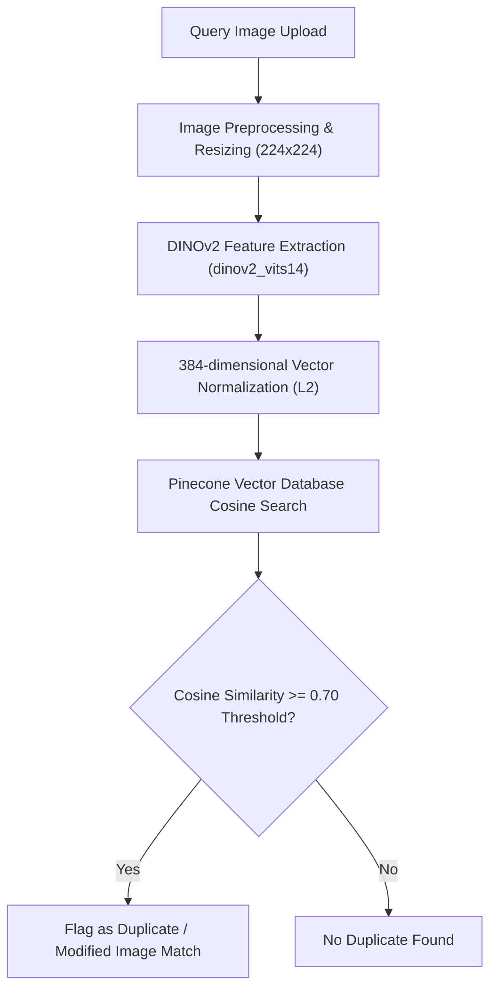
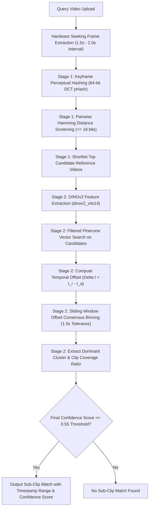

# SameShot: Duplicate Image and Video Detection System

SameShot (Binary-Brains) is a high-performance content duplicate detection system built for finding exact, cropped, scaled, color-adjusted, and temporal sub-clip duplicates across large media databases. 

The system leverages deep feature representation via DINOv2 for images and binary perceptual hashing (pHash) with Pinecone Vector Database spatial and temporal alignment for ultra-fast, cloud-scalable image and video duplicate retrieval.

---

## Overview

Modern media platforms process massive volumes of visual content where duplicate or near-duplicate detection is critical for content moderation, copyright enforcement, and storage optimization. SameShot provides a microservices-based architecture that addresses two core challenges:

1. **Image Duplicate Retrieval**: High-precision vector similarity search using Vision Transformer embeddings (DINOv2 Small / `dinov2_vits14`) indexed in **Pinecone Vector Database** with complementary perceptual hashing.
2. **Video Duplicate & Sub-Clip Retrieval**: Perceptual video frame fingerprinting indexed in **Pinecone Vector Database** with temporal offset consensus clustering for exact sub-clip timestamp detection.

---

## Architecture and Microservices

The repository is structured as a multi-tier microservices application:

```
[ Frontend (React + Vite + Tailwind) ]
         |                         |
         v (Port 8000)             v (Port 8001)
[ Image Service (backend/) ]  [ Video Service (backend2/) ]
   - DINOv2 (384-dim)           - Frame pHash (64-dim float)
   - Pinecone Vector DB         - Pinecone Vector DB
   - Perceptual Hashing         - Temporal Alignment Search
```

### 1. Image Duplicate Detection Service (`backend/`)
- **Model**: DINOv2 (`dinov2_vits14`) self-supervised Vision Transformer.
- **Embedding Dimensionality**: 384 dimensions (L2-normalized).
- **Vector DB**: Pinecone Vector Database (Cosine Similarity Metric, `image-search-index`).
- **Fallback / Hybrid Engine**: Perceptual Hash (pHash) filtering via `imagehash`.
- **API Port**: `8000`

### 2. Video Duplicate & Sub-Clip Retrieval Service (`backend2/`)
- **Frame Extraction**: Hardware-accelerated direct seeking via OpenCV (1 frame per 1.5s - 2.0s).
- **Stage 1 Retrieval (Coarse Filter)**: Fast bitwise Hamming distance computation on 64-bit perceptual keyframe hashes (pHash) to shortlist top candidate reference videos.
- **Stage 2 Retrieval (Fine Vector Alignment)**: DINOv2 384-dim Vision Transformer embeddings queried against **Pinecone Vector Database** (filtered by Stage 1 candidates).
- **Temporal Alignment**: Offset consensus binning to detect temporal alignment windows and sub-clip ranges within longer reference videos.
- **API Port**: `8001`

### 3. Frontend Web Interface (`frontend/`)
- Built with React 19, TypeScript, Vite, and TailwindCSS.
- Real-time video previewing, timestamp match visualization, confidence breakdown, and pool upload management.

---

## Technology Stack

- **Core Backend Framework**: Python 3.12, FastAPI, Uvicorn
- **Computer Vision & ML**: PyTorch, OpenCV, DINOv2, ImageHash
- **Vector Search Engine**: Pinecone Vector Database (Serverless Cloud Vector Indexing)
- **Frontend Framework**: React 19, TypeScript, Vite, TailwindCSS
- **Containerization**: Docker, Docker Compose

---

## Directory Structure

```
SameShot/
├── backend/                  # Image Duplicate Detection Microservice
│   ├── main.py               # Frame index processing and DINOv2 feature store management
│   ├── search_image.py       # Vector retrieval and similarity ranking
│   ├── server.py             # FastAPI endpoints for image upload, search, and reset
│   ├── pinecone_db.py        # Pinecone Vector Database client & vector upsert engine
│   ├── imageHash.py          # Perceptual hash utility functions
│   └── Dockerfile            # Container configuration for image backend
│
├── backend2/                 # Video Duplicate & Sub-Clip Microservice
│   ├── main.py               # 2-Stage Video index builder and vector store manager
│   ├── search_video.py       # 2-Stage Video retrieval (Stage 1 pHash + Stage 2 DINOv2 Pinecone)
│   ├── server.py             # FastAPI endpoints for video pool upload, query, and analysis
│   ├── pinecone_db.py        # Pinecone Vector Database integration for frame vectors
│   ├── utils.py              # Frame extraction, pHash calculation & Hamming distance matrix utilities
│   └── Dockerfile            # Container configuration for video backend
│
├── frontend/                 # React Web Application
│   ├── src/
│   │   ├── pages/            # Views for DuplicateImg.tsx and DuplicateVid.tsx
│   │   └── components/       # Layout, Navigation, and Card UI elements
│   ├── package.json
│   └── Dockerfile            # NGINX container configuration for frontend production
│
├── .env.example              # Environment variables template (Pinecone API key & indices)
├── docker-compose.yml        # Orchestration manifest for all microservices
└── README.md                 # Project documentation
```

---

## System Flowcharts

### 1. Image Processing & Duplicate Search Pipeline



### 2. 2-Stage Video Duplicate & Sub-Clip Retrieval Pipeline



---

## How It Works: Algorithms and Techniques

### Image Duplicate Detection Pipeline
1. **Preprocessing**: Images are converted to RGB, resized to 224x224, and normalized using ImageNet statistics.
2. **Feature Extraction**: Passed through `dinov2_vits14` to produce a 384-dimensional feature vector.
3. **Pinecone Indexing**: Normalized feature vectors are upserted into Pinecone Vector Database with associated image metadata and pHash.
4. **Query & Scoring**: Cosine similarity is computed against indexed vectors in Pinecone. A configurable threshold (default `0.70`) identifies exact and modified duplicates.

### 2-Stage Video Duplicate Detection & Sub-Clip Alignment
1. **Keyframe Extraction**: OpenCV extracts frames at fixed time intervals (default 1.5s to 2.0s) using direct frame position seeking.
2. **Stage 1 (pHash Coarse Filtering)**:
   - Computes 64-bit DCT perceptual hashes (`imagehash.phash`) for query keyframes.
   - Evaluates fast bitwise Hamming distance matrix against stored reference keyframe hashes.
   - Filters and selects top candidate reference videos with frame Hamming distance $\le 18$ bits out of 64.
3. **Stage 2 (DINOv2 Fine Alignment & Pinecone Search)**:
   - Computes 384-dimensional DINOv2 visual embeddings for query keyframes.
   - Queries Pinecone Vector Database (`video-search-index`) applying a metadata filter restricted to Stage 1 candidate filenames.
4. **Temporal Consensus Clustering**:
   - For each matching frame pair (Query timestamp $t_q$, Reference timestamp $t_r$), the temporal offset is computed: $\Delta t = t_r - t_q$.
   - Offsets are grouped into 1.5-second sliding tolerance windows.
   - The cluster with the highest density of consistent temporal offsets defines the aligned video clip match.
5. **Scoring & Timestamp Range**: The final clip score combines normalized frame similarity and clip coverage:
   $$\text{Final Score} = 0.7 \times \text{Average Cluster Score} + 0.3 \times \left(\frac{\text{Unique Matched Query Frames}}{\text{Total Query Frames}}\right)$$

---

## Environment Variables Configuration

Copy `.env.example` to `.env` in the project root and provide your Pinecone credentials:

```bash
cp .env.example .env
```

`.env` configuration keys:

```env
# Required: Pinecone API Key
PINECONE_API_KEY=your_pinecone_api_key_here

# Optional: Custom Pinecone Index Names
PINECONE_IMAGE_INDEX=image-search-index
PINECONE_VIDEO_INDEX=video-search-index
```

---

## API Reference

### Image Backend (`http://localhost:8000`)

| Method | Endpoint | Description |
|---|---|---|
| `POST` | `/upload/pool` | Upload reference image files to the reference pool and Pinecone index |
| `POST` | `/upload/query` | Upload a query image to search for duplicates |
| `GET` | `/analyze` | Run vector search via Pinecone and return top matching duplicate images |
| `POST` | `/reset` | Clear stored images and reset the Pinecone vector index |
| `DELETE` | `/delete/pool/{filename}` | Remove a single image from the pool and Pinecone vector store |

### Video Backend (`http://localhost:8001`)

| Method | Endpoint | Description |
|---|---|---|
| `POST` | `/upload/pool` | Upload reference video files (`.mp4`, `.avi`, `.mov`, `.mkv`) and index keyframes in Pinecone |
| `POST` | `/upload/query` | Upload a query video clip |
| `GET` | `/analyze` | Extract keyframe hashes, query Pinecone vector DB, perform temporal consensus, and return matches with timestamp ranges |
| `POST` | `/reset` | Clear stored reference videos and reset the Pinecone video index |
| `DELETE` | `/delete/pool/{filename}` | Remove a video from the Pinecone index and filesystem |

---

## Getting Started

### Prerequisites

- Docker and Docker Compose (recommended)
- Python 3.12+ (for local manual execution)
- Node.js 18+ and npm (for local frontend execution)
- Pinecone Account & API Key ([Get API Key](https://app.pinecone.io/))

### Option 1: Running with Docker Compose (Recommended)

1. Clone the repository:
   ```bash
   git clone https://github.com/yogesh-3324/SameShot.git
   cd SameShot
   ```

2. Create `.env` file and set `PINECONE_API_KEY`:
   ```bash
   cp .env.example .env
   # Edit .env and insert your PINECONE_API_KEY
   ```

3. Build and start all microservices:
   ```bash
   docker-compose up --build
   ```

4. Open your browser and navigate to:
   - Frontend UI: `http://localhost:80`
   - Image API Docs: `http://localhost:8000/docs`
   - Video API Docs: `http://localhost:8001/docs`

---

### Option 2: Running Locally (Manual Setup)

1. Set environment variables or configure `.env` at root.

2. **Start Image Backend (Port 8000)**
   ```bash
   cd backend
   pip install -r requirements.txt
   python server.py
   ```

3. **Start Video Backend (Port 8001)**
   ```bash
   cd backend2
   pip install -r requirements.txt
   python server.py
   ```

4. **Start Frontend (Port 5173)**
   ```bash
   cd frontend
   npm install
   npm run dev
   ```

Access the frontend at `http://localhost:5173`.

---

## License

This project is licensed under the MIT License.